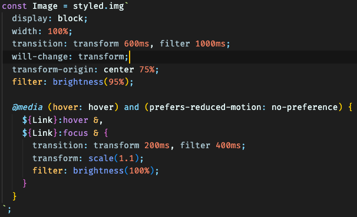

# Sole&Ankle, Animated — Module 8 workshop

Once again, we're working on the sneaker store!


In this workshop, we're going to use our newly-acquired animation skills to breathe some life into this application.

**Some parts of this workshop are unguided.** Each exercise will challenge you to go beyond the stated goal, to come up with your own twist on the interaction.

Also, **don't forget about accessibility.** Significant motion should be disabled by default, and only enabled based on the `prefers-reduced-motion` media query.

## Troubleshooting

If you run into problems running a local development server, check out our [Troubleshooting Guide](https://courses.joshwcomeau.com/troubleshooting) on the course platform.

This guide addresses the common `Digital Envelope Routine` error you may have seen.

---

## Exercise 1: Sneaker Zoom

Add a hover/focus interaction to the sneakers so that the image zooms in slightly:


This might seem like a small task, but there are lots of little details that make it tricky. Pay close attention to the GIF. Some things to watch out for:

- The enter transition should be faster than the exit transition
- The "flags" for new releases and sales should hang over the edge of the photo, as they do initially.
- The corners should remain perfectly round at all times.
- The shoes aren't centered within the photos, so if you zoom into the center of the photo, the shoe will appear to drop lower. Tweak the animation so that it zooms in on the shoe.

The relevant component is `ShoeCard.js`.

### Stretch Goal

Once you've matched the GIF above, it's time to get creative. Change or extend the animation. Experiment with different techniques and properties!

Here are some ideas:

- In addition to the photo zoom, tweak the new/sale flags in some way.
- Use a CSS filter on the photo.

---

## Exercise 2: Navigation link flip-up

When hovering over the navigation links on desktop, they should "flip up", revealing a bold copy underneath:


In order to accomplish this challenge, **you'll need to tweak the JSX.** There's no way to solve this problem in CSS alone. In particular, you'll need to duplicate the text inside each navigation link.

The relevant component is `Header.js`. You may wish to create a new `NavLink` component, though it isn't required.

### Stretch Goal

Here's a list of over a dozen link hover animations: https://tympanus.net/Development/CreativeLinkEffects/

Try and implement another effect from the list!

---

## Exercise 3: Modal enter animation

On mobile, add the following animations to the hamburger menu:


This effect consists of 3 individual animations:

1. The backdrop fades in.
2. The drawer slides in from the right.
3. The drawer's contents fade in.

For bonus points, use a custom easing curve on the slide-in animation. You can configure one using this tool: https://cubic-bezier.com.

Don't worry about the exit animation; exit animations are difficult in React, and require a library like [React transition group](https://reactcommunity.org/react-transition-group/).

The relevant component is `MobileMenu.js`.

### Stretch Goal

Here are some ideas:

- Experiment with different orchestrations, animating different elements at different times
- Use a 3D transform on the drawer so that it swings in like a door closing rather than sliding in from offscreen
- Instead of fading in all of the drawer's contents at once, add a staggered fade to the individual navigation links so that they fade in one by one, from the top down

## Note to self

### Exercise 1

#### Rejigging HTML structure to incorporate image zoom animation

The HTML structure for a 'show card' is something like this:

```
    <Link>
      <Wrapper>
        <ImageWrapper>
          <Image />
          <SaleFlag>Sale</SaleFlag>
        </ImageWrapper>
        ...
      </Wrapper>
    </Link>
```

or in non-styled components terms:

```
    <a>
      <article>
        <div>
          
          <div>Sale</div>
        </div>
        ...
      </article>
    </a>
```

Adding the zoom interaction is easy enough:

```
const Image = styled.img`
  ...
  transition: transform 600ms;

  ${Link}:hover &,
  ${Link}:focus & {
    transition: 200ms;
    transform: scale(1.1);
  }
`;
```

The image will zoom in quickly (in 200ms) when hovered/focussed, and then depress slowly (600ms) when the mouse pointer moves away.

However, there were a few issues that needed to be resolved as a result of incorporating this animation:

1. Hiding the overflow when the image expands

   Use `overflow: hidden` on `ImageWrapper`.

2. Ensuring the corners were perfectly round

   Move the `border-radius` from the image to the wrapper. Also, eliminate the 'magic space' issue by setting `display: block` on the image.

3. Ensuring flags overlapped the card image

   As a result of adding `overflow: hidden` on the wrapper, it meant the overhang effect of the flags were also being clipped. The solution was to take out the flags from `ImageWrapper` and place it relative to the `Wrapper` instead.

4. Ensuring shoe zooms in from center of shoe

   This involved changing the center/origin of the `scale` transform from the center of the picture to the center of the shoe, which is about 3 quarters down from the top, so on the `Image` we apply: `transform-origin: 50% 75%`.

As a final note, to ensure we are being good in terms of accessibility, we move the code that animates the element to a `media` query:

```
  @media (hover: hover) and (prefers-reduced-motion: no-preference) {
    ${Link}:hover &,
    ${Link}:focus & {
      transform: scale(1.1);
      transition: transform 200ms;
    }
  }
```

#### Stretch goal

For the image, I messed around with `brightness` and `saturation` on the CSS `filter` property but most transitions looked a bit 'cheap'. From solution video: a good idea is to dim the 'normal' state of the image to 90-95% brightness, so that on hover we can bump it up to 100% brightness, which gives us a nice-looking effect.



The other thing I did (after a lot of messing around) was add a simple `translateX` on the `Flag` component so that it moves out slightly as the image expands, then recedes back as the image depresses. Initially I tried a `keyframes` animation whereby the flag would oscillate, but couldn't figure out how to [smoothly revert an animation](https://pragmaticpineapple.com/smoothly-reverting-css-animations/) when the mouse moves away, so settled on this.
